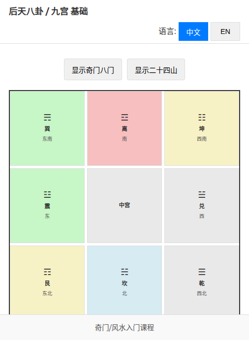

# qishui - 水到奇成 Prerequisites Learning App

[](https://github.com/limcheekin/qishui/actions/workflows/deploy.yaml)

An interactive web application designed to help users learn the foundational concepts of Chinese metaphysics. This project serves as a prerequisite learning tool for the "水到奇成" (Shuǐ Dào Qí Chéng – "Success comes when conditions are ripe") course.

**Live Demos:**
*   **Main App (Ba Gua / Qimen Foundations):** [https://limcheekin.github.io/qishui/](https://limcheekin.github.io/qishui/)
*   **Qimen Flashcards:** [https://limcheekin.github.io/qishui/flashcard/qimen.html](https://limcheekin.github.io/qishui/flashcard/qimen.html)

## Table of Contents

*   [Overview](#overview)
*   [Key Features](#key-features)
    *   [Main Application: Ba Gua / Qimen Foundations](#main-application-ba-gua--qimen-foundations)
    *   [Qimen Flashcard Application](#qimen-flashcard-application)
*   [Screenshots](#screenshots)
*   [Technology Stack](#technology-stack)
*   [Project Structure](#project-structure)
*   [Usage](#usage)
*   [Development](#development)
*   [Deployment](#deployment)
*   [License](#license)

## Overview

The **qishui** project encompasses two main web-based learning tools:

1.  **Ba Gua / Qimen Foundations App (`index.html`):** An interactive application focusing on:
    *   后天八卦 (Hòutiān Bāguà - Later Heaven Ba Gua) / 九宫格 (Jiǔ Gōng Gé - Nine Palaces Grid)
    *   五行 (Wǔ Xíng - Five Elements) theory and interactions.
    *   Basic concepts of 奇门遁甲 (Qímén Dùnjiǎ), including the Eight Gates (八门 - Bā Mén) and their home palaces, and the Twenty-Four Mountains (二十四山 - Èrshísì Shān).
    *   This main application was created based on concepts introduced in the YouTube video [《水到奇成》推广课](https://www.youtube.com/watch?v=2FykEOX-dqU) to prepare the author for attending the offline class on 17 May 2025.
2.  **Qimen Flashcard App (`flashcard/qimen.html`):** A supplementary tool for learning and searching key Qimen Dunjia terminology.

Both applications are designed to be intuitive, responsive, and bilingual (Simplified Chinese and English), providing a solid foundation for students of the "水到奇成" course.

## Key Features

### Main Application: Ba Gua / Qimen Foundations (`index.html`)

*   **Interactive Ba Gua Grid:** A visual 3x3 grid representing the Houtian Ba Gua / Jiu Gong Ge. Users can click on each of the 8 outer palaces to view detailed information.
*   **Qimen Eight Gates Overlay:** Toggleable overlay to display the original Eight Gates (八门) within their respective Ba Gua palaces.
*   **24 Mountains Overlay:** Toggleable overlay to subdivide each Ba Gua palace into its three corresponding 24 Mountains segments, each clickable for more details.
*   **Detailed Information Panel:** A dynamic panel displaying comprehensive information about the selected palace or mountain, including:
    *   Trigram details, direction, and element.
    *   Wu Xing (Five Elements) interactions (generating, controlling cycles).
    *   Qimen Gate properties and conceptual explanations (when Gate overlay is active).
    *   24 Mountains specifics, degree ranges, and Feng Shui implications (when Mountain overlay is active).
*   **Bilingual Support:** Full localization for Simplified Chinese (default) and English, with an easy-to-use language switcher. Language preference is saved in `localStorage`.
*   **Static Informational Sections:** Collapsible sections providing essential background knowledge:
    *   How to Use This App
    *   About Wu Xing (The Five Elements) - with SVG diagrams
    *   About Directions, Luopan & 24 Mountains - with an SVG diagram
    *   About this App & Course Next Steps
    *   Glossary of Terms
*   **Responsive Design:** Adapts to various screen sizes for optimal viewing on desktop, tablet, and mobile devices.
*   **SVG Diagrams:** Dynamically generated SVG visuals for Wu Xing cycles and Luopan subdivision for better understanding.
*   **Accessibility:** Designed with keyboard navigation and ARIA attributes for improved accessibility.

### Qimen Flashcard Application (`flashcard/qimen.html`)

*   **Comprehensive Qimen Dunjia Vocabulary:** A collection of key terms and their definitions related to Qimen Dunjia.
*   **Search Functionality:** Allows users to quickly search for specific terms or keywords within definitions.
*   **Bilingual Support:** Full localization for Simplified Chinese (default) and English, with a language switcher.
*   **Responsive Design:** Clean and readable interface on all devices.
*   **Dynamic Card Display:** Flashcards are dynamically rendered based on the selected language and search query.

## Screenshots




## Technology Stack

*   **HTML5**
*   **CSS3**
*   **Vanilla JavaScript (ES6+)**
*   No external JavaScript or CSS libraries are used. Both applications are self-contained single HTML files.

## Project Structure

```
└── qishui/
    ├── README.md               # This file
    ├── index.html              # Main Ba Gua / Qimen Foundations application
    ├── LICENSE                 # MIT License
    ├── spec.md                 # Specifications for index.html
    ├── flashcard/
    │   ├── qimen.html          # Qimen Dunjia Flashcard application
    │   └── qimen_spec.md       # Specifications for flashcard/qimen.html
    └── .github/
        └── workflows/
            └── deploy.yaml     # GitHub Actions workflow for deployment
```

## Usage

### Accessing the Applications

*   **Main App (Ba Gua / Qimen Foundations):** Open [index.html](https://limcheekin.github.io/qishui/)
*   **Qimen Flashcards:** Open [flashcard/qimen.html](https://limcheekin.github.io/qishui/flashcard/qimen.html)

### Main Application (`index.html`)

1.  **Language Selection:** Use the language switcher in the header to toggle between Chinese (中文) and English (EN).
2.  **Interacting with the Grid:** Click on any of the 8 outer Ba Gua palaces.
3.  **Information Panel:** Information about the selected palace will appear in a panel. Click the '×' button, press the 'Escape' key, or click outside the panel to close it.
4.  **Toggling Overlays:**
    *   Click "Show Qimen Gates" (显示奇门八门) to overlay Qimen Gate information on the grid and in the info panel. Click again to hide.
    *   Click "Show 24 Mountains" (显示二十四山) to subdivide palaces into 24 Mountain segments. Click on a segment for details. Click again to hide.
    *   Both overlays can be active simultaneously.
5.  **Static Information:** Expand the sections below the grid (e.g., "How to Use This App", "About Wu Xing") to read more.

### Qimen Flashcard Application (`flashcard/qimen.html`)

1.  **Language Selection:** Use the language buttons (中文 / English) to switch the language of terms and definitions.
2.  **Search:** Type keywords into the search bar to filter the flashcards by term or definition.
3.  **Browse:** Scroll through the displayed flashcards.

## Development

To run the applications locally:

1.  Clone the repository:
    ```bash
    git clone https://github.com/limcheekin/qishui.git
    ```
2.  Navigate to the project directory:
    ```bash
    cd qishui
    ```
3.  Open the HTML files in your web browser:
    *   For the main application: Open `index.html`
    *   For the flashcard application: Open `flashcard/qimen.html`

All code (HTML, CSS, JavaScript) is inline within these respective files.

## Deployment

This project is automatically deployed to GitHub Pages via a GitHub Actions workflow (`.github/workflows/deploy.yaml`). Any push to the `main` branch will trigger a deployment to the `gh-pages` branch, updating the live demos.

## License

This project is licensed under the MIT License. See the [LICENSE](LICENSE) file for details.
